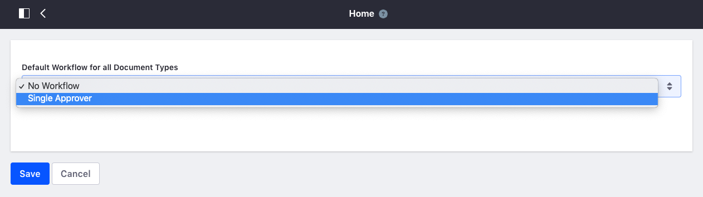

# Headless APIs Workflow
In this demo, we are going to explain how to enable Single Approver workflow for Documents and Media. Then, you can see the pending workflow tasks in the list of tasks assigned to my roles.

## Enabling workflow
To enable workflow for Documents and Media: 

* Go to Site > Documents and Media
* Click Edit to configure our workflow

## My tasks
Now, we can upload a document and it will need a review to be approved:

And then if we go to **My Workflow Tasks** under the user section:

## Liferay Developer Network

If you want read more about workflow, please read the documentation in the Developer Network: 

* [Workflow Liferay 7.0](https://dev.liferay.com/es/discover/portal/-/knowledge_base/7-0/using-workflow)
* [Workflow Liferay 7.1](https://dev.liferay.com/es/discover/portal/-/knowledge_base/7-1/workflow)